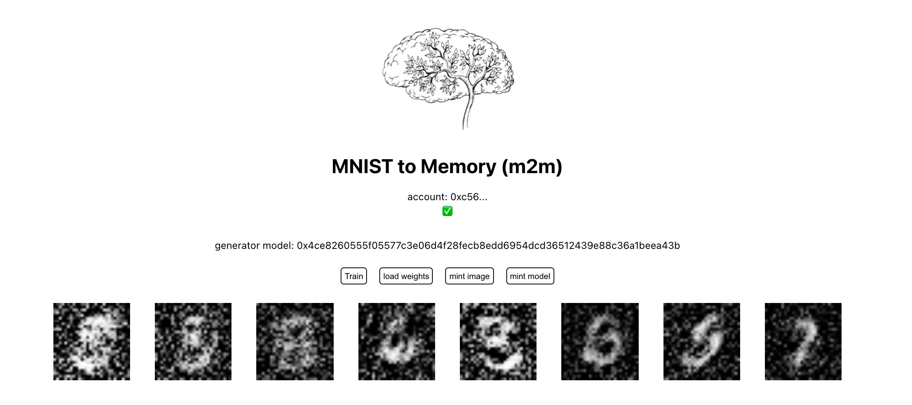

# MNIST to memory (m2m)

The project aims to research & reconsider NFTs as not only static assets, but as dynamic generators of new token assets. [Demo Video here](https://www.youtube.com/watch?v=SY_ZUN1geeQ)

## technologies used
- ethereum
- zora (NFThack winner)
- ipfs

In this new model, the NFT provenance chain representation can begin to create points or “structures of geometric relations” that aligns user contribution of model updates, towards increasing technical individuation from generative model preferences. NFT models can become personalized, in order to construct a type of globally accessible intelligence or brain.

In the future, the project concept might be used with personal data off-chain to train, learn, and mint new tokens from decentralized stored models.

